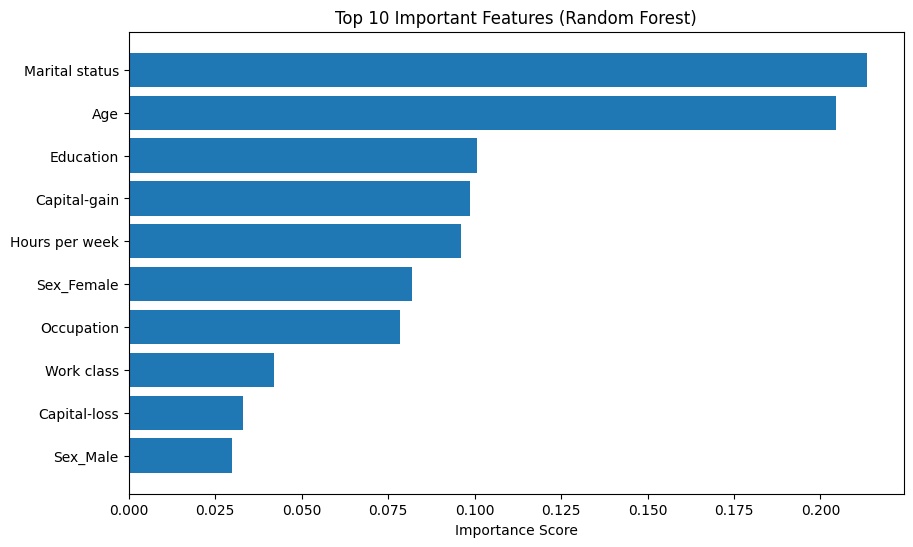

# US Census Income Classification Project

## 📌 Project Overview
This project is a machine learning web application that predicts whether a person's income exceeds $50K/year based on census data. Using the 1994 US Census (Adult) dataset, various classification algorithms were trained and evaluated. The final model (Random Forest) is deployed using a **Flask** web application for real-time predictions.

## 📂 Dataset Details
* **Source:** 1994 US Census Database.
* **Goal:** Binary classification to predict if salary is `<=50K` or `>50K`.

### Feature Descriptions
The dataset consists of the following features:

| Feature | Description |
| :--- | :--- |
| **Age** | Age of the individual. |
| **Work Class** | Indicates the nature of their employment (e.g., Private, Self-employed, Government). |
| **Fnlwgt (Final Weight)** | Indicates how many people the census believes the entry represents (estimated value based on demographics). |
| **Education** | Indicates the highest level of education achieved. |
| **Education Num** | Indicates the total number of years spent in school/education. |
| **Marital Status** | Indicates the individual's marital status. |
| **Occupation** | Indicates the individual's job role or profession. |
| **Relationship** | Indicates the individual's family role/status (e.g., Husband, Wife, Unmarried). |
| **Race** | Indicates the individual's race/ethnicity. |
| **Sex** | Indicates the individual's gender. |
| **Capital Gain** | Indicates income/profit made through investments (e.g., stocks). |
| **Capital Loss** | Indicates money lost through investments. |
| **Hours per Week** | Indicates the number of hours worked per week. |
| **Native Country** | Indicates the individual's country of origin. |
| **Salary (Target)** | **The target variable.** Indicates whether the individual's income is `>50K` or `<=50K`. |

## 🛠️ Tech Stack
* **Frontend:** HTML, CSS
* **Backend:** Python, Flask
* **Machine Learning:** Scikit-learn, Pandas, NumPy
* **Serialization:** Joblib

## 📊 Model Performance Evaluation
During the training phase, several models were tested to find the best balance of accuracy and F1-score. Below are the comparative results obtained during testing. The **Random Forest Classifier** metrics reflect the performance after hyperparameter tuning.

| Model | Accuracy | Precision (Weighted) | Recall (Weighted) | F1-Score (Weighted) |
| :--- | :---: | :---: | :---: | :---: |
| **Random Forest Classifier (Tuned)** | **0.88** | **0.88** | **0.88** | **0.88** |
| **K-Neighbors Classifier** | 0.84 | 0.85 | 0.84 | 0.84 |
| **AdaBoost Classifier** | 0.83 | 0.83 | 0.83 | 0.83 |
| **Decision Tree Classifier** | 0.83 | 0.83 | 0.83 | 0.83 |
| **Support Vector Classifier** | 0.76 | 0.76 | 0.76 | 0.76 |
| **Naive Bayes** | 0.76 | 0.76 | 0.76 | 0.76 |
| **Logistic Regression** | 0.75 | 0.75 | 0.75 | 0.75 |

> **Conclusion:** The **Random Forest Classifier** achieved the highest accuracy (**88%**) and F1-score after tuning, making it the most robust model for this dataset. It was consequently selected for the final deployment.

## 📈 Feature Importance Analysis (Additional Contribution)
To improve model interpretability, I extracted the **Feature Importance** scores from the tuned Random Forest model. This analysis reveals which factors contribute most significantly to income prediction.

**Key Observations:**
* * Here age and marital status are found to be the most critical indicators of income levels